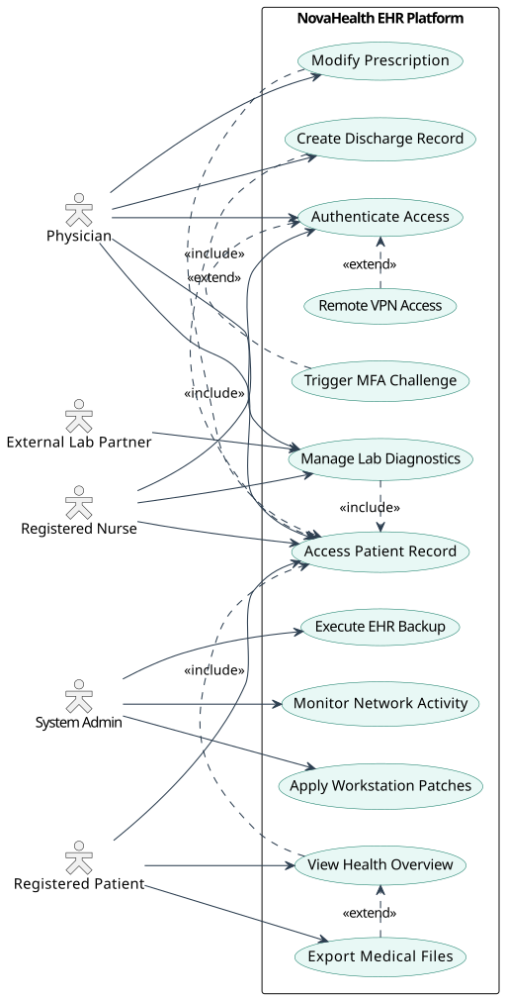
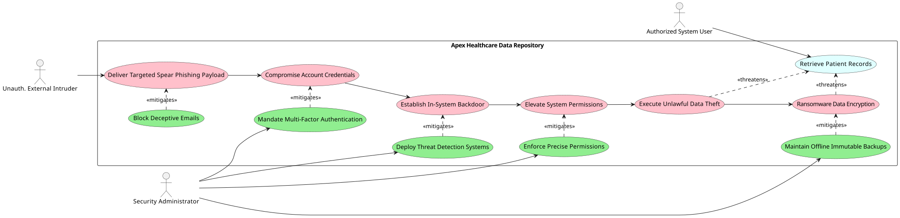

# Secure System Design Portfolio

A security-focused portfolio of threat modeling, secure coding, UML use/misuse-case analysis, security monitoring, and defensive architecture work.

## Highlights

- **Healthcare security modeling:** EHR use-case and misuse-case diagrams showing realistic attacker paths and defensive controls.
- **Ransomware threat modeling:** Analysis of a simulated healthcare ransomware scenario with MITRE ATT&CK and CVE mapping.
- **Secure coding:** Defensive analysis covering SQL injection, XSS, CSRF, session security, password storage, error handling, and login abuse.
- **Security monitoring:** A state model covering detection, verification, alerting, containment, investigation, recovery, and fail-safe operation.
- **Authentication security:** Data-flow modeling for credential verification, authorization, audit logging, and security alerts.
- **Microsoft Threat Modeling Tool:** Native `.tm7` models for an Azure web/API architecture and an online banking system.

## Visual Highlights

### EHR Use-Case Model


### EHR Misuse-Case Model


## Repository Structure

```text
.
├── README.md
├── diagrams/
│   ├── ehr-use-case-diagram.svg
│   ├── ehr-use-case-diagram.png
│   ├── ehr-misuse-case-diagram.svg
│   ├── ehr-misuse-case-diagram.png
│   ├── healthcare-security-misuse-case.pdf
│   ├── security-monitoring-state-diagram.pdf
│   └── authentication-security-data-flow.pdf
├── docs/
│   ├── ransomware-threat-model.md
│   ├── secure-coding-analysis.md
│   ├── lms-security-analysis.md
│   ├── online-banking-threat-model.md
│   └── security-monitoring-state-model.md
└── source/
    ├── visio/
    │   ├── healthcare-misuse-case-model.vsdx
    │   ├── security-monitoring-state-model.vsdx
    │   └── authentication-security-data-flow.vsdx
    └── threat-modeling-tool/
        ├── azure-web-api-threat-model.tm7
        └── online-banking-threat-model.tm7
```

## Skills Demonstrated

### Threat Modeling
- Use-case and misuse-case modeling
- Attack-path analysis
- Security control mapping
- MITRE ATT&CK technique mapping
- CVE awareness and vulnerability analysis

### Secure Design
- Network segmentation
- Endpoint Detection and Response (EDR)
- Immutable/offline backups
- RBAC and least privilege
- DLP and audit logging
- Secure authentication and session controls

### Secure Coding
- Parameterized database queries
- Input validation and output encoding
- Authentication hardening
- Password hashing
- Secure error handling
- Login-attempt controls

## Scope

These artifacts are educational security-design work created for coursework and portfolio demonstration. The repository emphasizes analysis, modeling, and defensive controls rather than deployable offensive tooling.

Native source files are included where useful so the models can be inspected or continued in the relevant design software.

## Author

Abdul Moiz
